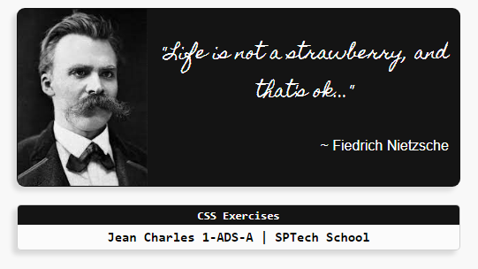
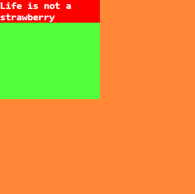

# CSS Exercises - SPTech

CSS exercises given at SPTech School during Research and Innovation class on March 1, 2024

## How to use

1. Clone this repository 
 ```` 
 git clone https://github.com/jeancharlesx64/css-exercise.git
 ````
2. Open `index.html` files in your browser

## Screenshots
 <br>
Little fun after structuring with CSS

<br>

 <br>
Standard structure, without any creative structuring

